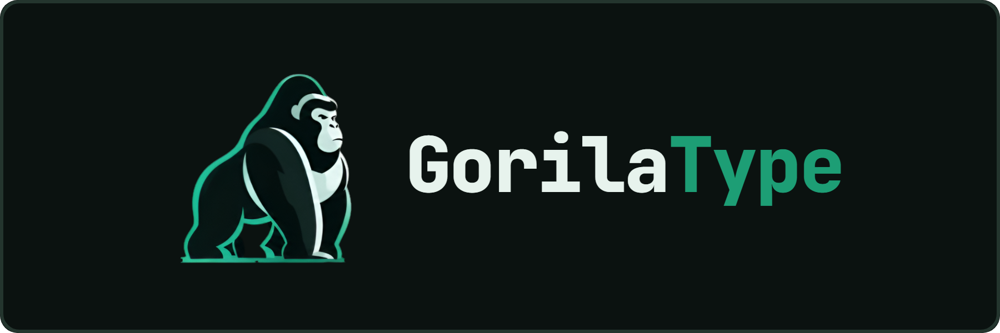

# CHANGELOG

---

Todos los cambios relevantes del proyecto se documentan en este archivo. El formato sigue [Keep a Changelog](https://keepachangelog.com/), y el versionado sigue [Versionado Semántico](https://semver.org/lang/es/).

## [Sin publicar]

### Agregado

- Documentación base del proyecto: convención de documentación, visión y alcance del MVP, arquitectura (backend y frontend), Gitflow, Jira, estándares de código, plantilla de historias de usuario y convención de assets.
- Branding inicial: logo (`logo.svg` y favicons derivados), banner (`banner.png`) y paleta de colores del tema principal.
- Scaffold del frontend: React 19 + TypeScript + Vite, Tailwind CSS 4, estructura por feature/módulo, rutas base (home, perfil, settings, leaderboard, auth, about, not-found) con `react-router-dom`, layout principal, ESLint + Prettier.
- Scaffold del backend: .NET 10 con Clean Architecture (Domain, Application, Infrastructure, Api), CORS habilitado para el frontend, Swagger con UI, conexión a PostgreSQL (Supabase) vía EF Core, CSharpier.
- Variables sensibles centralizadas en `.env`/`.env.example` en la raíz del monorepo.
- `package.json` en la raíz con scripts para levantar, formatear e instalar frontend y backend desde un solo lugar.
