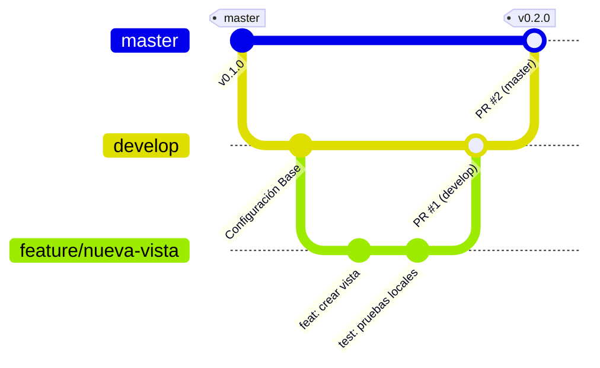
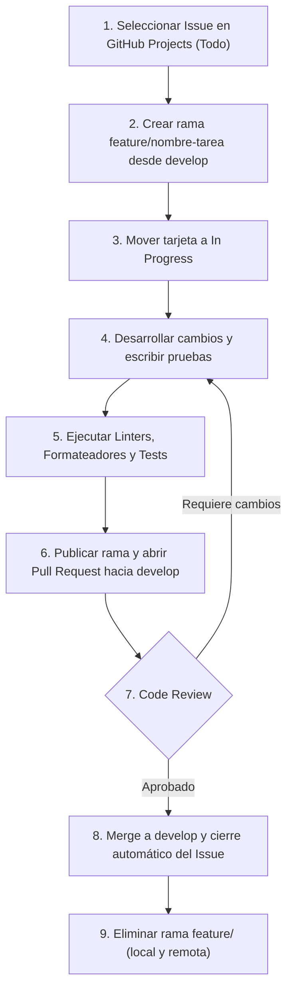
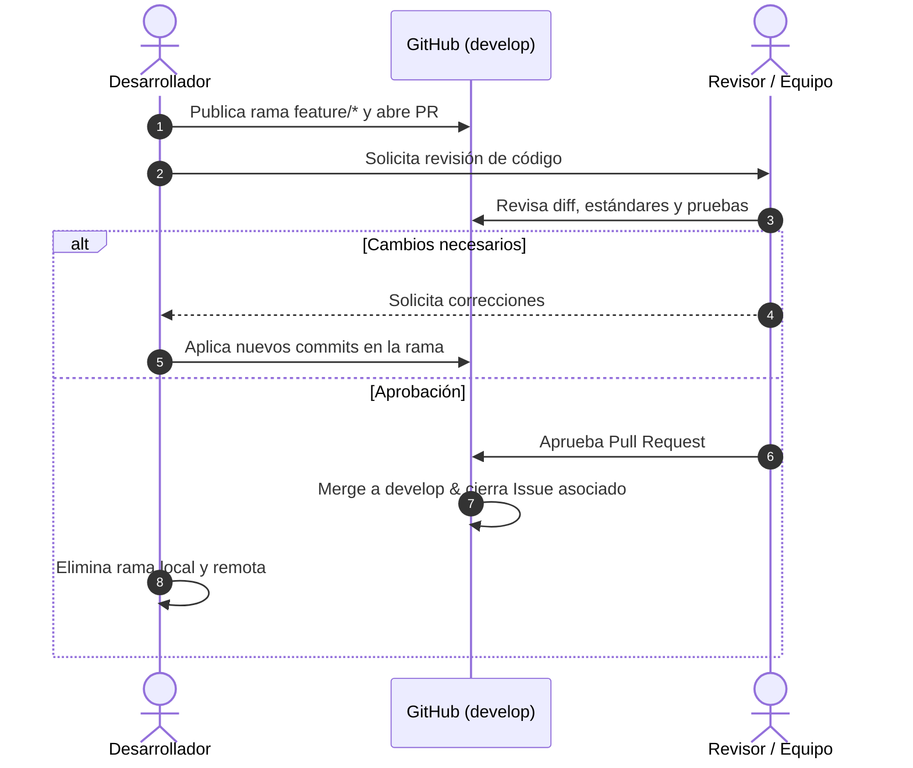
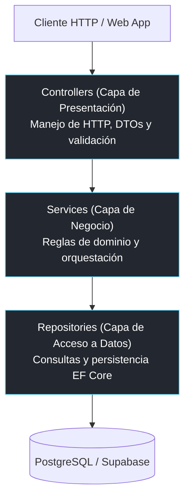
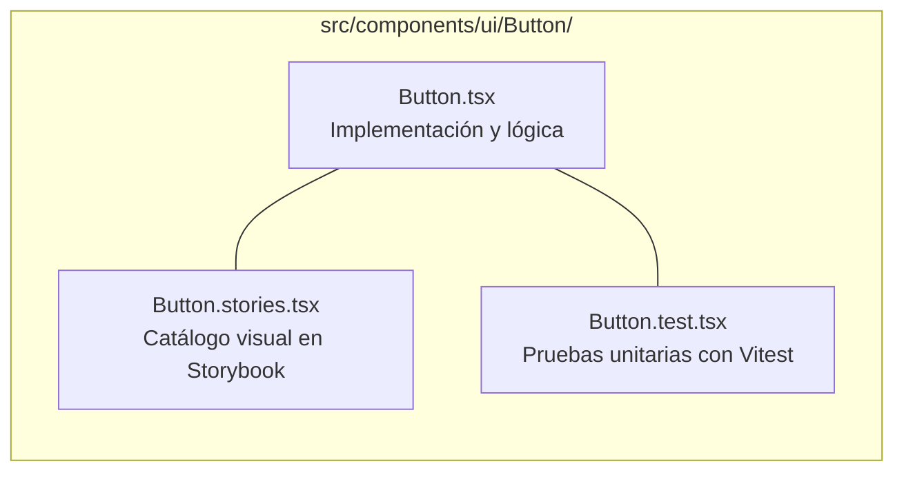

# Contributing to GorilaType

> Guía oficial de contribución para el proyecto GorilaType. Establece los estándares técnicos, la configuración del entorno local, la estrategia de ramificación en Git y los criterios de calidad necesarios para colaborar en el desarrollo.

[](#4-flujo-de-trabajo-y-estrategia-de-git)
[](https://www.conventionalcommits.org/)
[](#5-estándares-de-arquitectura-y-código)

**Última actualización:** 2026-09-01  
**Autor(es):** Petra761  

---

## Índice

- [1. Principios de contribución](#1-principios-de-contribución)
- [2. Requisitos del sistema](#2-requisitos-del-sistema)
  - [Herramientas globales recomendadas](#herramientas-globales-recomendadas)
- [3. Configuración del entorno local](#3-configuración-del-entorno-local)
  - [3.1 Clonar el repositorio](#31-clonar-el-repositorio)
  - [3.2 Backend (.NET 10)](#32-backend-net-10)
  - [3.3 Frontend (React 19 + Vite)](#33-frontend-react-19--vite)
- [4. Flujo de trabajo y estrategia de Git](#4-flujo-de-trabajo-y-estrategia-de-git)
  - [4.1 Modelo de ramas](#41-modelo-de-ramas)
  - [4.2 Diagrama de Git Flow](#42-diagrama-de-git-flow)
  - [4.3 Ciclo de vida de una tarea](#43-ciclo-de-vida-de-una-tarea)
  - [4.4 Convención de commits](#44-convención-de-commits)
  - [4.5 Proceso de Pull Request y Code Review](#45-proceso-de-pull-request-y-code-review)
- [5. Estándares de arquitectura y código](#5-estándares-de-arquitectura-y-código)
  - [5.1 Arquitectura del Backend](#51-arquitectura-del-backend)
  - [5.2 Arquitectura del Frontend y regla del trío](#52-arquitectura-del-frontend-y-regla-del-trío)
- [6. Checklist de verificación previo a PR](#6-checklist-de-verificación-previo-a-pr)
- [7. Reporte de incidencias y propuestas](#7-reporte-de-incidencias-y-propuestas)
  - [Reportar un Error (Bug Report)](#reportar-un-error-bug-report)
  - [Proponer una Mejora o Feature](#proponer-una-mejora-o-feature)
- [8. Referencias de documentación](#8-referencias-de-documentación)

---

## 1. Principios de contribución

El desarrollo de GorilaType sigue una metodología profesional orientada a la mantenibilidad y consistencia del código:

- **Calidad técnica:** Todo código nuevo debe incluir pruebas unitarias, apegarse a las convenciones de tipado estricto y respetar las capas arquitectónicas.
- **Claridad en el historial:** Los commits deben ser atómicos y seguir el estándar de Conventional Commits.
- **Revisiones rigurosas:** Ningún cambio se integra a las ramas principales sin validación cruzada mediante Pull Request.

---

## 2. Requisitos del sistema

Antes de iniciar el entorno de desarrollo, verifica contar con las versiones requeridas:

| Herramienta | Versión mínima | Propósito |
|---|---|---|
| **.NET SDK** | `10.0.x` | Compilación y ejecución de la API backend. |
| **Node.js** | `v20.x` (LTS) | Entorno de ejecución y scripts del frontend. |
| **npm** | `v10.x` | Gestor de paquetes para Node.js. |
| **Git** | `2.40+` | Control de versiones distribuido. |

### Herramientas globales recomendadas

```bash
# Herramienta de línea de comandos para Entity Framework Core
dotnet tool install --global dotnet-ef

# Restauración de herramientas locales del repositorio (incluye CSharpier)
dotnet tool restore
```

---

## 3. Configuración del entorno local

### 3.1 Clonar el repositorio

```bash
git clone https://github.com/Petra761/GorilaType.git
cd GorilaType
```

---

### 3.2 Backend (.NET 10)

1. **Acceder a la carpeta del backend y restaurar dependencias:**
   ```bash
   cd backend
   dotnet restore
   dotnet tool restore
   ```

2. **Configuración de variables de entorno:**
   - Copia `.env.example` de la raíz del repositorio hacia `.env`.
   - Completa las cadenas de conexión correspondientes a PostgreSQL (Supabase).

   > [!IMPORTANT]
   > Nunca subas el archivo `.env` ni credenciales reales al repositorio. Las configuraciones locales se encuentran ignoradas por Git.

3. **Ejecutar la API:**
   ```bash
   dotnet run --project src/GorilaType.Api
   ```
   - La documentación interactiva de Scalar estará disponible en `http://localhost:<puerto>/scalar`.

4. **Comandos de desarrollo y validación:**
   ```bash
   # Compilar el proyecto verificando advertencias
   dotnet build

   # Ejecutar suite de pruebas unitarias con xUnit
   dotnet test

   # Formatear el código fuente según las reglas del proyecto
   dotnet csharpier format .

   # Verificar el formateo de código sin alterarlo
   dotnet csharpier check .
   ```

5. **Manejo de migraciones de base de datos:**
   ```bash
   # Crear una nueva migración
   dotnet ef migrations add NombreMigracion --project src/GorilaType.Api

   # Aplicar migraciones pendientes
   dotnet ef database update --project src/GorilaType.Api

   # Revertir a un estado de migración previo
   dotnet ef database update NombreMigracionPrevia --project src/GorilaType.Api
   ```

---

### 3.3 Frontend (React 19 + Vite)

1. **Acceder a la carpeta del frontend e instalar paquetes:**
   ```bash
   cd ../frontend
   npm install
   ```

2. **Iniciar servidor de desarrollo:**
   ```bash
   npm run dev
   ```
   - La aplicación responderá en `http://localhost:5173`.

3. **Comandos de desarrollo y pruebas:**
   ```bash
   # Ejecutar pruebas unitarias con Vitest
   npm run test

   # Iniciar interfaz visual de pruebas
   npm run test:ui

   # Iniciar entorno de componentes Storybook (puerto 6006)
   npm run storybook

   # Análisis estático de código con ESLint
   npm run lint

   # Formateo de código con Prettier
   npm run format

   # Validación de build para producción
   npm run build
   ```

---

## 4. Flujo de trabajo y estrategia de Git

### 4.1 Modelo de ramas

El proyecto implementa un flujo basado en ramas de corta duración integradas hacia una rama troncal de desarrollo:

- **`master`**: Representa el estado estable desplegado en producción. Solo se modifica mediante merge desde `develop` al consolidar una versión.
- **`develop`**: Rama principal de desarrollo e integración continua. Todas las nuevas características se integran aquí.
- **`feature/*`**: Ramas de trabajo aisladas para tareas específicas. Se crean a partir de `develop` y se reintegran exclusivamente mediante Pull Requests.

---

### 4.2 Diagrama de Git Flow



---

### 4.3 Ciclo de vida de una tarea



---

### 4.4 Convención de commits

Se debe emplear el estándar de Conventional Commits. La estructura obligatoria es:

```
<tipo>: <descripción corta en imperativo>
```

| Tipo | Propósito | Ejemplo |
|---|---|---|
| `feat` | Incorporación de una nueva funcionalidad. | `feat: implement user registration endpoint` |
| `fix` | Corrección de un defecto o fallo. | `fix: resolve caret displacement on backspace` |
| `docs` | Modificación exclusiva de documentación. | `docs: add contributing guide with mermaid diagrams` |
| `refactor` | Cambio de código sin alterar comportamiento externo. | `refactor: extract metrics calculation into service` |
| `test` | Inclusión o actualización de pruebas unitarias. | `test: add test cases for typing accuracy calculation` |
| `chore` | Actualización de dependencias, scripts o configuración. | `chore: update tailwindcss to v4.3.3` |

---

### 4.5 Proceso de Pull Request y Code Review



---

## 5. Estándares de arquitectura y código

### 5.1 Arquitectura del Backend

El backend se organiza en una arquitectura de capas desacopladas donde las dependencias fluyen en un único sentido:



---

### 5.2 Arquitectura del Frontend y regla del trío

En el frontend, cada componente de interfaz ubicado en `src/components/ui/` debe estructurarse obligatoriamente bajo la regla del trío:



- **Variables CSS Semánticas:** Utiliza variables semánticas (`var(--bg-primary)`, `var(--text-accent)`) para asegurar la compatibilidad con el sistema multi-temas de GorilaType.
- **Tipado Estricto:** Evita el uso de `any`; define interfaces para props y estados.

---

## 6. Checklist de verificación previo a PR

Antes de solicitar la integración de tu código, valida cada uno de los siguientes puntos:

- [ ] **Formato de código:** CSharpier ejecutado en backend (`dotnet csharpier check .`) y Prettier en frontend (`npm run format:check`).
- [ ] **Pruebas unitarias:** Todas las suites de prueba en estado exitoso (`dotnet test` y `npm run test`).
- [ ] **Compilación limpia:** Cero advertencias y cero errores de compilación (`dotnet build` y `npm run build`).
- [ ] **Seguridad de secretos:** Ningún archivo `.env`, token o credencial sensible incluido en el diff (`git status` limpio).
- [ ] **Nomenclatura de commits:** Mensajes estructurados bajo Conventional Commits (`feat:`, `fix:`, `docs:`, etc.).
- [ ] **Documentación actualizada:** Cambios reflejados en `docs/` y registro correspondiente en `CHANGELOG.md`.

---

## 7. Reporte de incidencias y propuestas

### Reportar un Error (Bug Report)

Al abrir un Issue de tipo Bug, proporciona la siguiente estructura:

1. **Descripción breve:** Resumen claro del comportamiento anómalo.
2. **Pasos para reproducir:** Secuencia exacta de acciones para disparar el fallo.
3. **Resultado observado vs. Resultado esperado:** Comparativa entre el comportamiento actual y el deseado.
4. **Información del entorno:** Sistema operativo, navegador, resolución de pantalla y rama de trabajo.
5. **Logs y capturas:** Mensajes de la consola o captura visual si aplica.

### Proponer una Mejora o Feature

1. Comprueba en [`docs/requirements/`](./docs/requirements/) que la propuesta no esté contemplada previamente.
2. Abre un Issue detallando la motivación del cambio, la solución técnica o de diseño sugerida y los componentes afectados.

---

## 8. Referencias de documentación

| Documento | Ruta | Descripción |
|---|---|---|
| **Historial de Cambios** | [`CHANGELOG.md`](./CHANGELOG.md) | Registro de versiones y cambios del proyecto. |
| **Flujo de Git** | [`docs/workflow/git-flow.md`](./docs/workflow/git-flow.md) | Guía detallada de branching y gestión de tableros. |
| **Estándares de Código** | [`docs/guidelines/coding-standards.md`](./docs/guidelines/coding-standards.md) | Buenas prácticas para C# y React/TypeScript. |
| **Convenciones de Nombres** | [`docs/guidelines/naming-conventions.md`](./docs/guidelines/naming-conventions.md) | Nomenclatura para archivos, variables y clases. |
| **Guía de Estilo Markdown** | [`docs/guidelines/markdown-style-guide.md`](./docs/guidelines/markdown-style-guide.md) | Formato obligatorio para la documentación técnica. |
| **Arquitectura de Backend** | [`docs/architecture/backend-architecture.md`](./docs/architecture/backend-architecture.md) | Diseño en capas de la API .NET 10. |
| **Arquitectura de Frontend** | [`docs/architecture/frontend-architecture.md`](./docs/architecture/frontend-architecture.md) | Organización de React, temas y componentes. |
| **Diagrama de Base de Datos** | [`docs/architecture/database-diagram.md`](./docs/architecture/database-diagram.md) | Esquema relacional PostgreSQL v2. |
| **Historias de Usuario** | [`docs/requirements/user-stories/`](./docs/requirements/user-stories/) | Historias de usuario funcionales (`GT-01` a `GT-09`). |
| **Contexto para IA** | [`docs/ai-context.md`](./docs/ai-context.md) | Reglas y contexto para herramientas de IA. |
