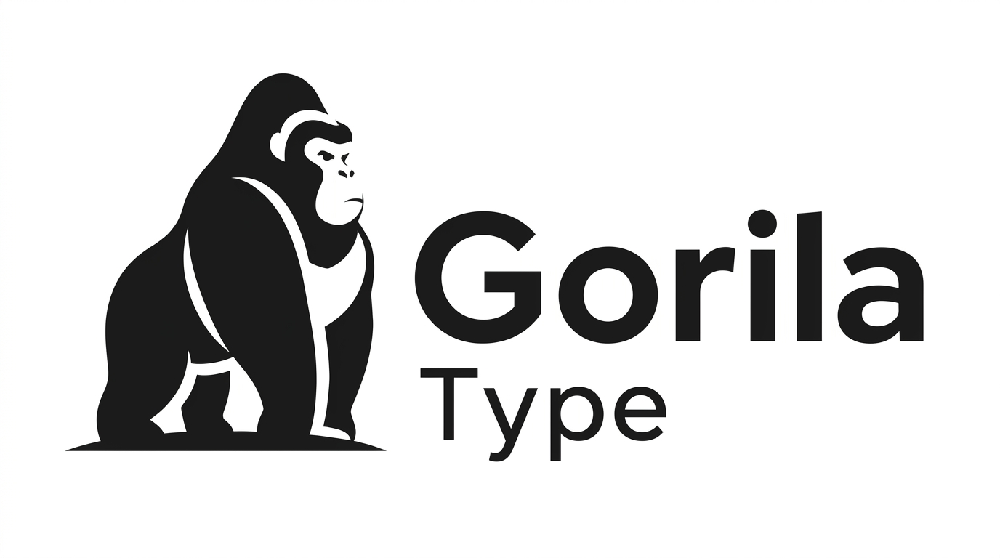

  

  <h3>Un test de mecanografía, hecho para aprender a construir software en serio.</h3>

  

    
    
    
    
    
    
  

---

## Sobre el proyecto

**GorilaType** es una app de práctica de mecanografía inspirada en [Monkeytype](https://monkeytype.com/). Es un proyecto de aprendizaje: el objetivo no es competir con la app original, sino practicar un flujo de trabajo profesional completo — arquitectura en capas, control de versiones, testing, documentación y buenas prácticas de equipo — de principio a fin.

## Stack

|                   |                                                                                            |
| ----------------- | ------------------------------------------------------------------------------------------ |
| **Backend**       | .NET 10 · Web API en capas (Controllers → Services → Repositories) · Entity Framework Core |
| **Frontend**      | Vite · React 19 · TypeScript · React Router · Tailwind CSS v4 · Storybook · Vitest         |
| **Base de datos** | PostgreSQL vía [Supabase](https://supabase.com/)                                           |
| **Auth**          | JWT                                                                                        |

## Empezar a desarrollar

Toda la guía de instalación, comandos y flujo de trabajo está en [`CONTRIBUTING.md`](./CONTRIBUTING.md).

## Documentación

|                      |                                                            |
| -------------------- | ---------------------------------------------------------- |
| Arquitectura         | [`docs/architecture/`](./docs/architecture/)               |
| Guías y convenciones | [`docs/guidelines/`](./docs/guidelines/)                   |
| Requisitos           | [`docs/requirements/`](./docs/requirements/)               |
| Flujo de Git         | [`docs/workflow/git-flow.md`](./docs/workflow/git-flow.md) |

## Equipo

- [**Petra761**](https://github.com/Petra761)
- [**marcelollanos456-lang**](https://github.com/marcelollanos456-lang)
