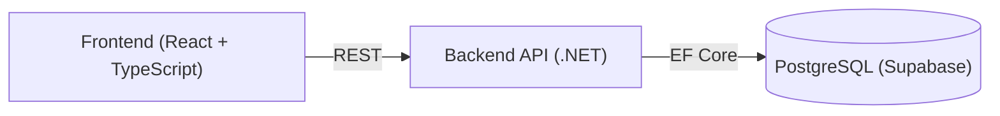

<div align="center">


**Plataforma web de mecanografía: test, lecciones guiadas y modo competitivo, construida como ejercicio de desarrollo profesional.**

[](https://react.dev/)
[](https://www.typescriptlang.org/)
[](https://vitejs.dev/)
[](https://tailwindcss.com/)
[](https://dotnet.microsoft.com/)
[](https://www.postgresql.org/)
[](#10-licencia-y-propiedad)

</div>

---

## 1. Descripción General

GorilaType es una plataforma web de mecanografía construida como ejercicio de aprendizaje para aplicar prácticas profesionales de desarrollo (documentación, Gitflow, Jira, arquitectura, estándares de código), con el objetivo adicional de ser una pieza destacada de portafolio profesional.

La visión del producto contempla tres frentes:

1. Un test de mecanografía que iguale o supere las características de Monkeytype.
2. Lecciones guiadas y estructuradas, al estilo TypingClub.
3. Un modo competitivo PvP / battle royale, al estilo Tetr.io aplicado a mecanografía.

El detalle completo de la visión y el alcance del MVP está en [docs/00-vision-y-alcance.md](./docs/00-vision-y-alcance.md).

---

## 2. Arquitectura del Sistema


```mermaid
flowchart LR
    Frontend["Frontend (React + TypeScript)"] -->|REST| Api["Backend API (.NET)"]
    Api -->|EF Core| Db[("PostgreSQL (Supabase)")]
```

Sin intermediarios entre frontend y backend. El detalle completo, incluyendo la organización interna de cada lado, está en [docs/01-arquitectura/](./docs/01-arquitectura/README.md).

---

## 3. Alcance Funcional del MVP

| Área                 | Contenido                                                                                                                                                           |
| :------------------- | :------------------------------------------------------------------------------------------------------------------------------------------------------------------ |
| Test de mecanografía | Todos los modos de Monkeytype, español e inglés, personalización de tema/tipografía/sonido/caret/modo ciego, niveles de dificultad, pantalla de resultados completa |
| Cuentas de usuario   | Email + contraseña, OAuth (GitHub, Discord, Google), modo invitado, recuperación de contraseña                                                                      |
| Perfil               | Perfil público, historial, grid de práctica, récords personales                                                                                                     |
| Leaderboard          | Ranking filtrable por idioma, modo y período                                                                                                                        |

Lecciones y PvP/battle royale quedan fuera del MVP; el detalle de ambos está documentado como roadmap futuro en [docs/00-vision-y-alcance.md](./docs/00-vision-y-alcance.md).

---

## 4. Stack Tecnológico

### Frontend

- **Librería de UI:** React 19.x
- **Lenguaje:** TypeScript 6.x
- **Herramienta de construcción:** Vite 8.x
- **Estilos:** Tailwind CSS 4.x, con design system propio de GorilaType

### Backend

- **Framework:** .NET 10
- **ORM:** Entity Framework Core
- **Base de datos:** PostgreSQL 18.x
- **Arquitectura:** Clean Architecture, organizada por módulo de negocio, con patrón Repository

El detalle de cada estándar está en [docs/03-estandares-de-codigo/](./docs/03-estandares-de-codigo/README.md).

---

## 5. Estructura del Proyecto

```text
.
├── docs/
│   └── ...
│
├── backend/
│   ├── GorilaType.Domain/
│   ├── GorilaType.Application/
│   ├── GorilaType.Infrastructure/
│   ├── GorilaType.Api/
│   └── GorilaType.slnx
│
├── frontend/
│   └── src/
│       ├── features/
│       ├── shared/
│       ├── routes/
│       └── assets/
│
├── .env.example                         # Copiar como .env y completar (nunca versionar .env)
├── package.json                         # Scripts para levantar/formatear frontend y backend desde la raíz
├── CHANGELOG.md
├── CONTRIBUTING.md
├── README.md
└── AGENT.md
```

---

## 6. Instalación y Entorno de Desarrollo

### Requisitos

- Node.js (versión LTS más reciente)
- .NET SDK 10
- Cuenta y proyecto en Supabase (para la base de datos PostgreSQL)

### Pasos

1. Clonar el repositorio.
2. Copiar `.env.example` como `.env` en la raíz, y completar la cadena de conexión de Supabase (`ConnectionStrings__DefaultConnection`).
3. Confiar el certificado de desarrollo HTTPS (una sola vez por máquina):
4. Instalar todas las dependencias (frontend + backend) en un solo paso:

```
npm install
npm run setup
```

5. Levantar frontend y backend juntos:

```
npm run dev
```

O por separado: `npm run dev:frontend` / `npm run dev:backend`.
Por defecto:

- Frontend: `http://localhost:5173`
- Backend (API + Swagger): `https://localhost:7092` (la raíz redirige automáticamente a `/swagger` en desarrollo)

## Docker está previsto para el desarrollo local, pero se implementará en una fase posterior del proyecto, no desde el arranque.

## 7. Flujo de Trabajo y Ramas (Gitflow)

```text
master          ---------------------------------------------- [Producción]
                       ^
                       | (release / hotfix)
develop         -------o-----------------o-------------------- [Integración]
                            \           /
feature/*                    -----------                       [Nuevas características]
fix/*                        -----------                       [Correcciones]
```

- `master`: versiones estables desplegadas.
- `develop`: rama principal de integración.
- `feature/GT-XX-descripcion`: ramas para historias de usuario y tareas.
- `fix/GT-XX-descripcion`: ramas para corrección de errores.

Todo cambio llega por Pull Request, nunca por merge directo. El detalle completo, incluyendo convención de commits y releases, está en [docs/02-flujo-de-trabajo/gitflow.md](./docs/02-flujo-de-trabajo/gitflow.md).

---

## 8. Gestión de Trabajo (Jira)

El trabajo se organiza en Jira, con tickets con formato `GT-XX`, organizados en sprints, e integrados con GitHub para que los Pull Requests muevan automáticamente el estado de cada ticket. El detalle completo está en [docs/02-flujo-de-trabajo/jira.md](./docs/02-flujo-de-trabajo/jira.md).

Las historias de usuario siguen la plantilla definida en [docs/04-historias-de-usuario/README.md](./docs/04-historias-de-usuario/README.md).

---

## 9. Despliegue

Durante la etapa de pruebas, la base de datos se aloja en Supabase, y tanto el frontend como el backend (dockerizado) se despliegan en Vercel, bajo demanda, cuando se quiere que alguien pruebe el estado actual del proyecto. No hay despliegue continuo por ahora.

---

## 10. Licencia y Propiedad

La licencia del repositorio todavía no está definida. Esta sección se actualizará cuando se tome esa decisión.

---

<div align="center">

**GorilaType**
_Un ejercicio de ingeniería de software convertido en producto._

</div>
