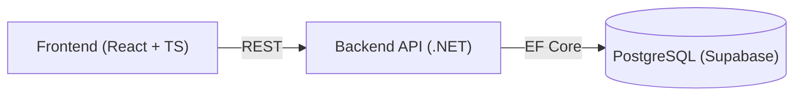

# Arquitectura

> Ubicación prevista en el repo: `docs/01-arquitectura/README.md`

Este documento resume la arquitectura general del MVP de GorilaType. El detalle de cada lado se documenta por separado: [backend.md](./backend.md) y [frontend.md](./frontend.md). Las decisiones que justifican estas elecciones se registran en [decisiones-arquitectonicas.md](./decisiones-arquitectonicas.md).

## 1. Vista general

Sin intermediarios: el frontend consume directamente la API del backend, que a su vez accede a PostgreSQL (alojado en Supabase durante la etapa de pruebas).

> Este diagrama cubre el alcance del MVP. Los módulos futuros (lecciones, PvP en tiempo real) se agregarán aquí cuando se aborden esas fases.

## 2. Documentos de esta carpeta

| Documento                                                        | Descripción                                                 |
| :--------------------------------------------------------------- | :---------------------------------------------------------- |
| [backend.md](./backend.md)                                       | Organización de las capas del backend por módulo de negocio |
| [frontend.md](./frontend.md)                                     | Organización del frontend por feature/módulo                |
| [decisiones-arquitectonicas.md](./decisiones-arquitectonicas.md) | Registro de decisiones arquitectónicas (ADR)                |
