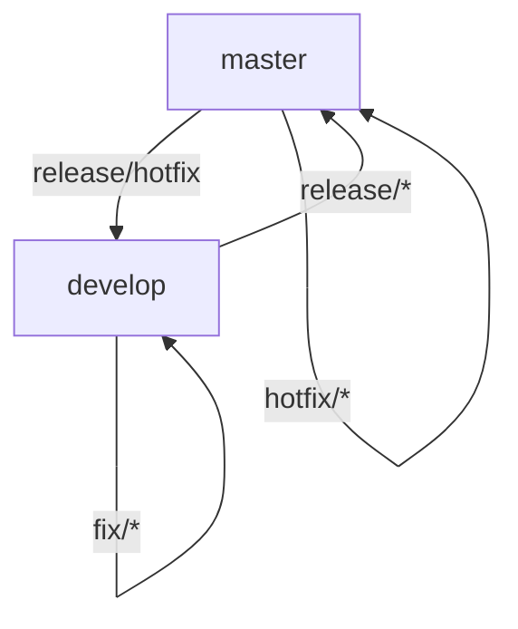

# Gitflow — GorilaType

> Ubicación prevista en el repo: `docs/02-flujo-de-trabajo/gitflow.md`

Este documento define el flujo de ramas y la convención de commits que sigue el proyecto. Está pensado para trabajarse en conjunto con [jira.md](./jira.md), que explica cómo se conectan los tickets con las ramas y los Pull Requests.

## 1. Ramas principales

- **`master`**: contiene únicamente versiones estables. Cada merge a `master` corresponde a un release etiquetado.
- **`develop`**: rama de integración. Todo el trabajo terminado se junta acá antes de pasar a `master`.

## 2. Ramas de trabajo

| Prefijo     | Se crea desde                      | Se mergea a            | Uso                                 |
| :---------- | :--------------------------------- | :--------------------- | :---------------------------------- |
| `feature/*` | `develop`                          | `develop`              | Nueva funcionalidad                 |
| `fix/*`     | `develop` (o `master` para hotfix) | `develop` (o `master`) | Corrección de errores               |
| `release/*` | `develop`                          | `master` y `develop`   | Preparación de una nueva versión    |
| `hotfix/*`  | `master`                           | `master` y `develop`   | Corrección urgente sobre producción |

## 3. Nombre de las ramas

El nombre de rama incluye el ID del ticket de Jira, con el formato `GT-XX`:

```
feature/GT-12-modo-tiempo
fix/GT-15-error-calculo-wpm
```

## 4. Convención de commits

Se usa **Conventional Commits**. El mensaje **no** incluye el ID de Jira (la trazabilidad se da a través del nombre de la rama y del PR).

```
feat: agregar modo de test por tiempo
fix: corregir cálculo de WPM con espacios extra
docs: documentar convención de Gitflow
refactor: extraer lógica de validación de texto
test: agregar pruebas del cálculo de accuracy
```

Tipos usados: `feat`, `fix`, `docs`, `refactor`, `test`, `chore`, `style`, `perf`.

## 5. Pull Requests

- Todo cambio llega a `develop` o `master` **exclusivamente por Pull Request**; nunca se hace push/merge directo.
- El título del PR incluye el ID de Jira entre corchetes, para que la integración de GitHub for Jira lo detecte y mueva el ticket automáticamente:

```
[GT-12] Agregar modo de test por tiempo
```

## 6. Releases

Cada vez que se hace un PR hacia `develop` o hacia `master`, se etiqueta la versión correspondiente usando versionado semántico (`vMAYOR.MENOR.PARCHE`), por ejemplo `v0.1.0`.

## 7. Diagrama del flujo


