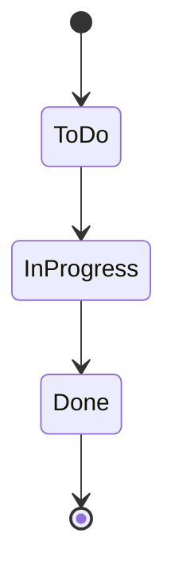

# Jira e integración con GitHub — GorilaType

> Ubicación prevista en el repo: `docs/02-flujo-de-trabajo/jira.md`

Este documento define cómo se organiza el trabajo en Jira y cómo se conecta con el flujo de Git descrito en [gitflow.md](./gitflow.md).

## 1. Prefijo del proyecto

El ID de cada ticket sigue el formato `GT-XX` (ej. `GT-01`, `GT-12`).

## 2. Tipos de issue

| Tipo        | Uso                                                                                                                       |
| :---------- | :------------------------------------------------------------------------------------------------------------------------ |
| **Épica**   | Agrupa un conjunto de tareas relacionadas (ej. "Sistema de autenticación")                                                |
| **Story**   | Historia de usuario, redactada según la plantilla de [docs/04-historias-de-usuario](../04-historias-de-usuario/README.md) |
| **Task**    | Trabajo técnico que no corresponde a una historia de usuario (ej. configurar CI, migrar una librería)                     |
| **Bug**     | Algo que debe corregirse                                                                                                  |
| **Subtask** | Un paso dentro de una Story o Task que requiere varios pasos para completarse                                             |

## 3. Flujo de estados

Al trabajar en solitario, no se usa `In Review`: la revisión la hace el mismo desarrollador antes de mergear el PR.

- **To Do**: ticket priorizado, listo para empezar.
- **In Progress**: en desarrollo activo.
- **Done**: mergeado a `develop` (o `master`, según corresponda) y cerrado.

## 4. Estimación

Los tickets se estiman con **story points** (dificultad relativa), no con horas ni tiempo estimado.

## 5. Sprints

El trabajo se organiza en sprints dentro de Jira.

## 6. Relación con Git

1. Se crea el ticket en Jira (`GT-XX`).
2. Se crea la rama con el formato definido en Gitflow: `feature/GT-XX-descripcion-corta`.
3. Se abre el Pull Request con el ID entre corchetes en el título: `[GT-XX] Descripción del cambio`.
4. La integración de GitHub for Jira detecta el ID en el título del PR y actualiza el estado del ticket automáticamente.

## 7. Configuración pendiente

- Configuración concreta de la integración GitHub for Jira (permisos, webhook) — se documentará una vez esté configurada en el proyecto real.
