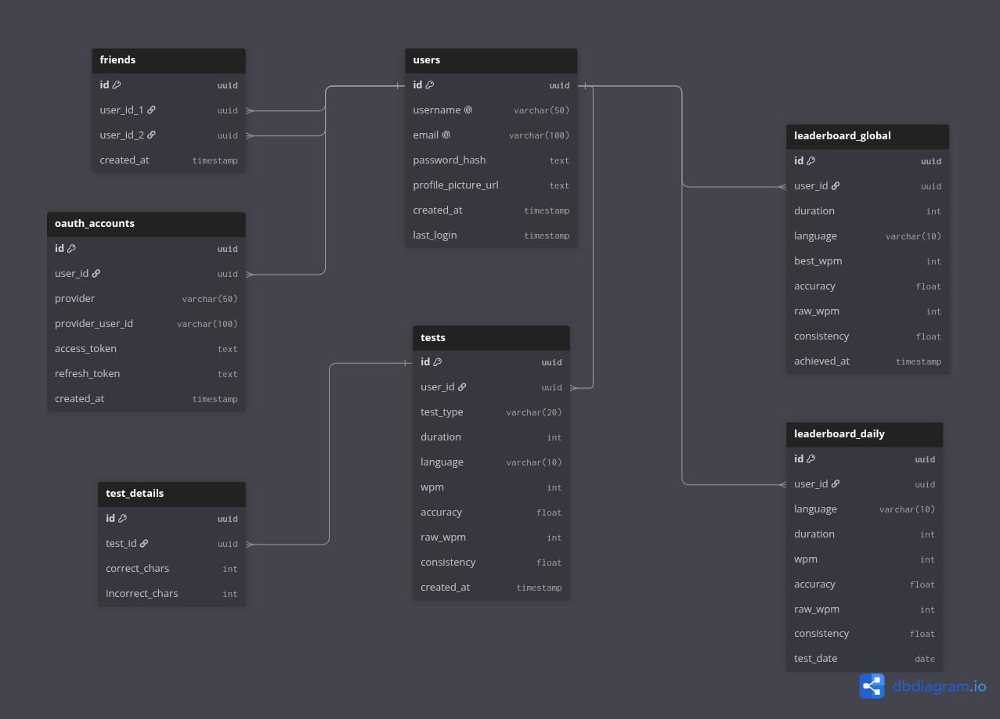

# Database Schema

> Esquema de la base de datos de la app de test de mecanografía, normalizado hasta 3FN. Para desarrolladores del proyecto GorilaType.

**Última actualización:** 2026-07-21
**Autor(es):** marcelollanos456-lang

---

## Descripción

Este documento describe el esquema de base de datos propuesto para la aplicación de test de velocidad de mecanografía. Incluye las tablas de usuarios, autenticación OAuth, tests, detalles de tests, leaderboards (global y diario) y relaciones de amistad entre usuarios.

## Diagrama



<!-- TODO: completar -->
<!-- Ajustar la ruta de la imagen según la ubicación final de este archivo dentro de docs/ -->

## Esquema DBML

```dbml
Table users {
  id uuid [pk]
  username varchar(50) [unique]
  email varchar(100) [unique]
  password_hash text
  profile_picture_url text
  created_at timestamp
  last_login timestamp
}

Table oauth_accounts {
  id uuid [pk]
  user_id uuid [ref: > users.id]
  provider varchar(50)
  provider_user_id varchar(100)
  access_token text
  refresh_token text
  created_at timestamp
}

Table tests {
  id uuid [pk]
  user_id uuid [ref: > users.id]
  test_type varchar(20) // time, palabras
  duration int
  language varchar(10)
  wpm int
  accuracy float
  raw_wpm int
  consistency float
  created_at timestamp
}

Table test_details {
  id uuid [pk]
  test_id uuid [ref: > tests.id]
  correct_chars int
  incorrect_chars int
  // raw_wpm eliminado: ya vive en tests, evita datos duplicados
}

Table leaderboard_global {
  id uuid [pk]
  user_id uuid [ref: > users.id]
  duration int
  language varchar(10)
  best_wpm int
  accuracy float
  raw_wpm int
  consistency float
  achieved_at timestamp
  indexes {
    (user_id, duration, language) [unique] // clave candidata completa
  }
}

Table leaderboard_daily {
  id uuid [pk]
  user_id uuid [ref: > users.id]
  language varchar(10)
  duration int
  wpm int
  accuracy float
  raw_wpm int
  consistency float
  test_date date
  indexes {
    (user_id, duration, language, test_date) [unique]
  }
}

Table friends {
  id uuid [pk]
  user_id_1 uuid [ref: > users.id]
  user_id_2 uuid [ref: > users.id]
  created_at timestamp
  indexes {
    (user_id_1, user_id_2) [unique]
  }
}
```

## Notas de diseño

- `test_details` no repite `raw_wpm` porque ya se almacena en `tests`, evitando redundancia.
- Los índices únicos compuestos en `leaderboard_global` y `leaderboard_daily` garantizan una sola entrada de leaderboard por combinación de usuario, duración e idioma (y fecha, en el caso diario).
- `friends` usa un índice único sobre `(user_id_1, user_id_2)` para evitar relaciones duplicadas.

[Enlace al Diagrama de la base de datos](https://dbdiagram.io/d/Gorila-Type-6a5052c94ac62e474c70ba5e)
