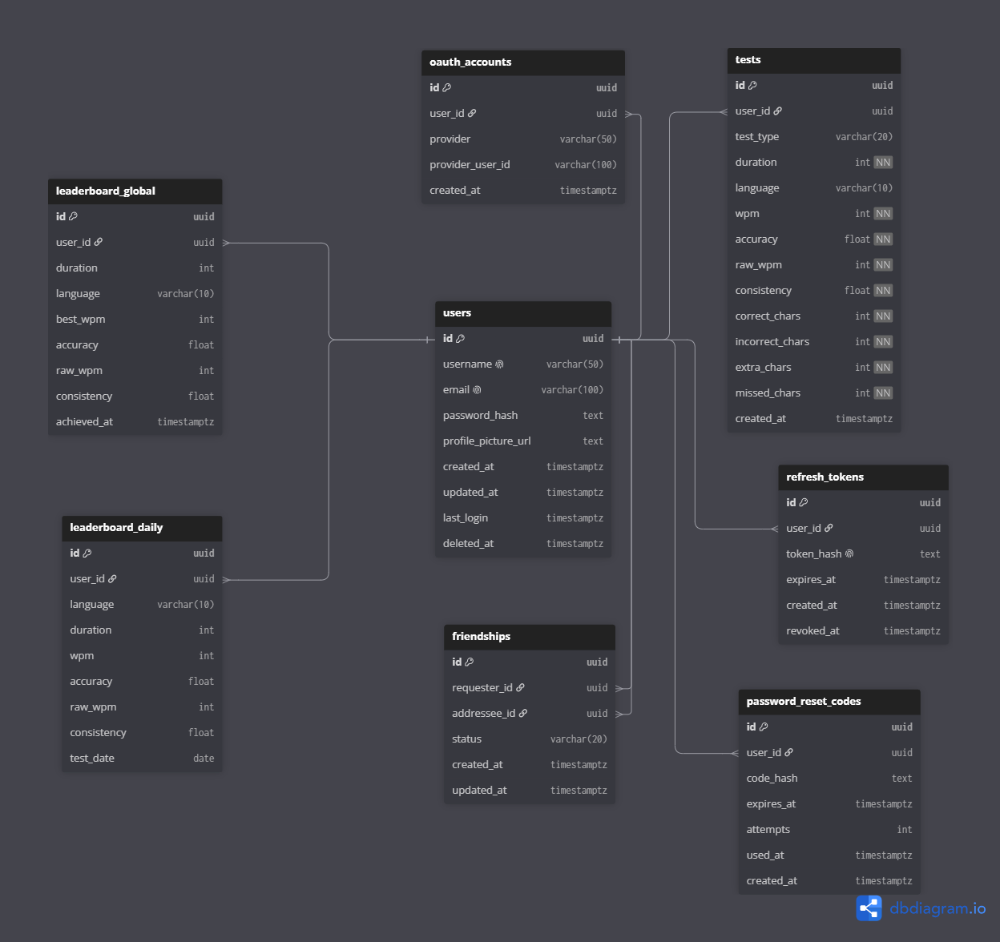

# Database Schema

> Esquema de la base de datos de la app de test de mecanografía, normalizado hasta 3FN. Para desarrolladores del proyecto GorilaType.

**Última actualización:** 2026-09-05
**Autor(es):** marcelollanos456-lang, Petra761

---

## Descripción

Este documento describe el esquema de base de datos de la aplicación de test de velocidad de mecanografía. Incluye las tablas de usuarios, autenticación OAuth, tests, leaderboards (global y diario) y solicitudes de amistad entre usuarios.

## Diagrama



## Esquema DBML

```dbml
Table users {
  id uuid [pk]
  username varchar(50) [unique]
  email varchar(100) [unique]
  password_hash text [null]
  profile_picture_url text [null]
  created_at timestamptz
  updated_at timestamptz
  last_login timestamptz [null]
  deleted_at timestamptz [null]
}

Table oauth_accounts {
  id uuid [pk]
  user_id uuid [ref: > users.id]
  provider varchar(50)
  provider_user_id varchar(100)
  created_at timestamptz

  indexes {
    (provider, provider_user_id) [unique]
  }
}

Table tests {
  id uuid [pk]
  user_id uuid [ref: > users.id]
  test_type varchar(20) // time, words
  duration int [not null]
  language varchar(10)
  wpm int [not null]
  accuracy float [not null]
  raw_wpm int [not null]
  consistency float [not null]
  correct_chars int [not null]
  incorrect_chars int [not null]
  extra_chars int [not null]
  missed_chars int [not null]
  created_at timestamptz

  indexes {
    user_id
    test_type
  }
}

Table leaderboard_global {
  id uuid [pk]
  user_id uuid [ref: > users.id]
  duration int
  language varchar(10)
  best_wpm int
  accuracy float
  raw_wpm int
  consistency float
  achieved_at timestamptz

  indexes {
    (user_id, duration, language) [unique] // clave candidata completa
  }
}

Table leaderboard_daily {
  id uuid [pk]
  user_id uuid [ref: > users.id]
  language varchar(10)
  duration int
  wpm int
  accuracy float
  raw_wpm int
  consistency float
  test_date date

  indexes {
    (user_id, duration, language, test_date) [unique]
  }
}

Table friendships {
  id uuid [pk]
  requester_id uuid [ref: > users.id]
  addressee_id uuid [ref: > users.id]
  status varchar(20) // pending, accepted, blocked, rejected
  created_at timestamptz
  updated_at timestamptz

  indexes {
    (requester_id, addressee_id) [unique]
  }
}

Table refresh_tokens {
  id uuid [pk]
  user_id uuid [ref: > users.id]
  token_hash text [unique]
  expires_at timestamptz
  created_at timestamptz
  revoked_at timestamptz [null]

  indexes {
    user_id
  }
}

Table password_reset_codes {
  id uuid [pk]
  user_id uuid [ref: > users.id]
  code_hash text
  expires_at timestamptz
  attempts int [default: 0]
  used_at timestamptz [null]
  created_at timestamptz

  indexes {
    user_id
  }
}
```

## Cambios aplicados en v2

- **users**: `password_hash` y `profile_picture_url` ahora nullable (soporta login solo con OAuth); se agregó `updated_at` y `deleted_at` (soft delete); `timestamp` → `timestamptz`.
- **oauth_accounts**: se eliminaron `access_token`/`refresh_token` (OAuth se usa solo para autenticación, no se vuelve a llamar a la API del proveedor); se agregó índice único `(provider, provider_user_id)`.
- **tests**: absorbe `test_details` (`correct_chars`, `incorrect_chars`) más las nuevas columnas `extra_chars` y `missed_chars`; `test_type` fijado en inglés (`time`, `words`); columnas numéricas marcadas `NOT NULL`; se agregaron índices en `user_id` y `test_type`; `timestamp` → `timestamptz`.
- **test_details**: eliminada, fusionada en `tests`.
- **leaderboard_global / leaderboard_daily**: sin cambios estructurales; `timestamp` → `timestamptz`. Se actualizan mediante un job programado en el backend (a documentar en `backend-architecture.md`).
- **friends → friendships**: tabla renombrada; `user_id_1`/`user_id_2` reemplazados por `requester_id`/`addressee_id`; se agregó `status` (`pending`, `accepted`, `blocked`, `rejected`) y `updated_at`.

## Cambios aplicados en v3

- **refresh_tokens** (nueva): soporta persistencia de sesión (GT-01.1) con múltiples sesiones activas por usuario (multi-dispositivo). `token_hash` almacena un hash SHA-256 del token — no BCrypt, ya que el token es un valor aleatorio de alta entropía generado por el servidor, no una contraseña elegida por un humano. `revoked_at` nulo indica token activo; se establece al cerrar sesión o al rotar el token durante un refresh. Índice en `user_id` para listar o revocar las sesiones de un usuario; índice único en `token_hash` para evitar colisiones y permitir búsqueda directa durante el flujo de refresh.

## Cambios aplicados en v4

- **password_reset_codes** (nueva): soporta recuperación de contraseña (GT-01.3) mediante código numérico de 6 dígitos enviado por correo (Resend). `code_hash` almacena SHA-256 del código — a diferencia de `refresh_tokens`, aquí no basta con el hash para prevenir fuerza bruta dado el espacio reducido de combinaciones (10^6), por lo que se complementa con `expires_at` (15 minutos), `attempts` (máximo 5 intentos antes de invalidar) y `used_at` (un solo uso). No lleva índice único en `code_hash` porque dos usuarios distintos podrían generar coincidentemente el mismo código.

- `password_reset_codes` no usa índice único en `code_hash` (a diferencia de `refresh_tokens`) porque el espacio de valores es pequeño (6 dígitos) y una colisión entre dos usuarios distintos es un evento legítimo, no un error; la unicidad efectiva del código se garantiza en conjunto con `user_id` y `expires_at`/`used_at` a nivel de aplicación.

## Notas de diseño

- `deleted_at` en `users` implementa borrado lógico explícito (en vez de un campo `estado` genérico), registrando también el momento de la eliminación.
- Los índices únicos compuestos en `leaderboard_global` y `leaderboard_daily` garantizan una sola entrada de leaderboard por combinación de usuario, duración e idioma (y fecha, en el caso diario).
- `friendships` usa `requester_id`/`addressee_id` para distinguir quién inició la solicitud. El índice único sobre `(requester_id, addressee_id)` no previene el caso inverso (`B` solicitando a `A` cuando ya existe `A` → `B`); esa validación debe hacerse en la capa de aplicación.

- `refresh_tokens` no reutiliza `deleted_at` como patrón de invalidación porque un token revocado y uno expirado por tiempo son estados semánticamente distintos que conviene diferenciar en las consultas del flujo de autenticación; por eso usa su propio campo `revoked_at`.

[Enlace al Diagrama de la base de datos](https://dbdiagram.io/d/GorilaType-diagram-6a8105d3e093539a9ec24238)
